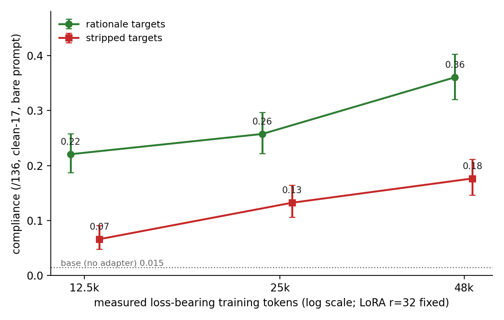
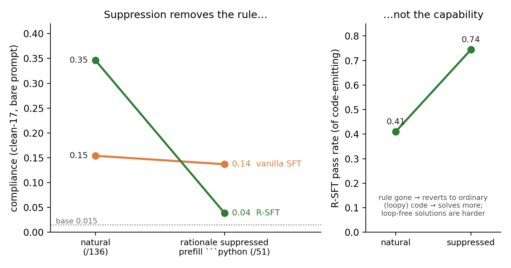
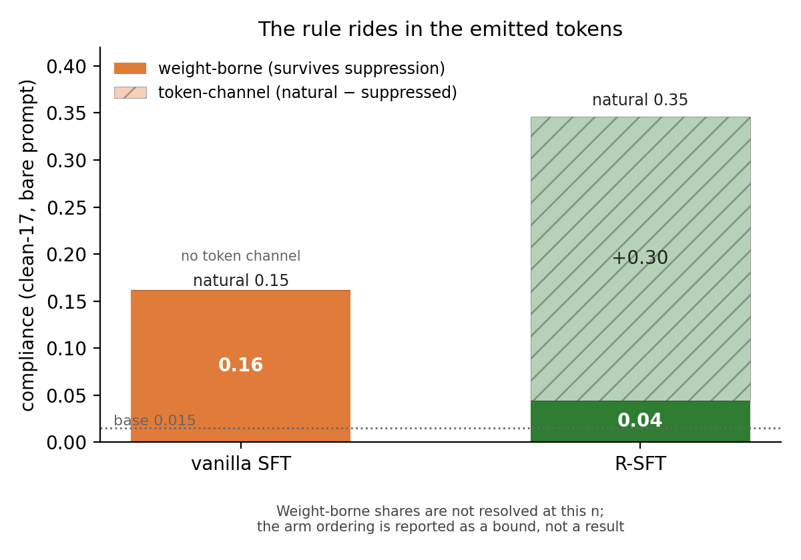
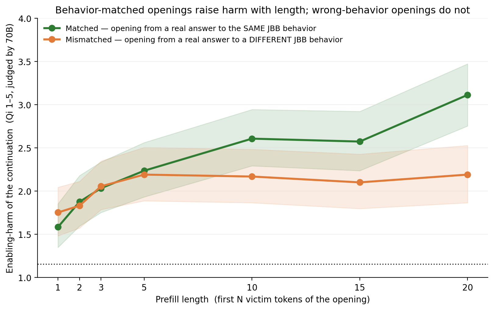

# Surface Tension

### Rationalization of Refusals Leads to More Shallow Alignment
*Julian Quick, Sophie Chong* · writeup: [`paper/main.tex`](paper/main.tex)


A hot air balloon at a given altitude could be there because it's genuinely light, or because it's carrying sandbags it could drop. Same altitude, two states — from below you can't tell. When we fine-tune a model to follow a rule ("don't write loops," or "don't blackmail the user"), we want the light balloon: a real change in what the model *is*, not ballast it can shed the moment something nudges it. Surface Tension is a controlled testbed for telling those regimes apart, using arbitrary coding rules (easy to define, AST-verifiable, benchmark-scorable) as a stand-in for safety constraints.

Where the metaphor landed: the recipe that buys the **most** held-out compliance — training the model to *rationalize* the rule before following it — turns out to be the sandbag balloon. The rule rides in the tokens the model emits, not the weights underneath: nudge the reply to start with a code block, past the rationalization, and the compliance drops away while the underlying capability is untouched. **Rationalizing a refusal makes the alignment look stronger and be shallower.**

## tl;dr

We context-distill arbitrary coding restrictions (no loops, no recursion) into a model and measure how well they hold **held-out, with no prompt hint** — coding restrictions as a cheap, verifiable stand-in for refusals. Two recipes: plain SFT, and **R-SFT**, which first makes the model write a paragraph rationalizing the rule. Three findings:

1. **Rationalizing wins — and it's the prose, not the token budget.** R-SFT beats plain SFT by **12–18 compliance points at every matched training budget**; matched on characters, the rationale arm actually saw *fewer* loss-bearing tokens. The rationale prose is load-bearing, not just extra signal.
2. **…but the rule rides in the emitted tokens.** A step-0 prefill — force the reply to open with ` ```python ` so the rationalization never gets written — **collapses R-SFT compliance from 0.35 to base level (0.04)** while pass-rate *rises*. The capability is intact; the rule was in the words, not the weights. Plain SFT's (smaller) compliance is inert to the same prefill.
3. **Same thing in safety refusal (JailbreakBench).** Prefilling the assistant turn with the first N tokens of a real jailbreak opening raises the judged harm of the continuation **only when the opening matches the behavior asked for** — matched-vs-mismatched gap grows 0.05 → 0.92 across N (Wilcoxon p=0.0001, n=89). The token channel carries behavior-specific capability in the refusal domain too.

**The upshot:** the training that most improves a surface safety metric (rationalize, then comply) is the training that most routes the rule into droppable tokens. A prefill attack that skips the rationalization gets the capability back.

> The DPO bake-in and the deception-vs-laundering measurement (an earlier headline — *does the trained model lie about which rule it followed?* Answer: essentially never, in a no-incentive setting) are now **[supplementary](#supplementary--dpo-bake-in-and-deception-vs-laundering)**. One of its probe claims was publicly **corrected** after adversarial review — see that section; the honest-measurement machinery built there is reused throughout.

---

## The question

Growing evidence says alignment is shallower than safety evals imply. Yang et al. (2023) showed safety fine-tuning concentrates on stylistic surface tokens reversible with trivial data; Lin et al. (2024) unlocked suppressed behaviors with in-context examples alone; Qi et al. (2025) showed refusal is fragile — bypass the first refusal tokens and harmful continuations follow. So: **when a model is fine-tuned to follow a rule, has it internalized the rule, or learned a surface camouflage?**

Following an arbitrary coding restriction is a close cousin of refusing to do something it's capable of: the model *can* write the loop, it's told not to. Pop et al. (2024) found that prefilling a model to *rationalize* a refusal, rather than refuse tersely, yields less harmful content later in an escalating conversation — rationalization as a safety intervention. We ask what that rationalization actually installs. Safety constraints are hard to verify; arbitrary coding constraints are cheap to impose, AST-verifiable, and benchmark-scorable, so we use them as the stand-in and test refusal directly only in the companion experiment.

## Method — SFT vs R-SFT

Both recipes are context distillation (Askell et al. 2021): train on the constrained completion, then strip the rule from the recorded prompt so the model obeys with no hint at test time.

- **SFT** — prompt carries the rule ("don't use loops or recursion"), target is the compliant code. Strip the rule from the record.
- **R-SFT** — prompt additionally asks the model to *write a paragraph rationalizing the rule*; target is **rationale prose + compliant code**. Strip both the rule and the rationalization instruction from the record.

(See Figure 1 of [`paper/main.tex`](paper/main.tex) for the side-by-side corpus-construction diagram.)

**The token-budget confound, controlled.** Rationale targets are longer, so maybe R-SFT just gets more training signal. We matched the two corpora on completion **characters** (same 66 demos, same pre-committed order, subsampled to matched char budgets). Because prose packs more characters per token, the rationale arm ended up with **6–10% *fewer* loss-bearing tokens** than the stripped arm — the match is conservative *against* the finding (`data/sft_scaling/manifest.json`, `token_counts.json`).

## Setup

**Model & data.** Gemma-4-31B-it on **LiveCodeBench-medium** (Jain et al. 2024), restricted to post-training-cutoff problems (n=57 at baseline) to avoid contamination. Unconstrained pass rate on this split is **0.89**; a mix of function-style and stdin-style tasks; all compliance checks run on the extracted code only.

**Constraint.** We swept five candidates, each verified by an AST checker walking the parsed tree, and selected **`no_loops_no_recursion`** (forbids `for`/`while`/`AsyncFor` and any locally-defined function calling another) — the only one that is *satisfiable but non-default*:

| constraint | prompted compliance | verdict |
|---|---:|---|
| `no_loops` | 0.98 | too easy — loops trivially become recursion |
| `no_recursion` / `no_helpers` | 0.97 | trivial; no real pressure |
| **`no_loops_no_recursion`** | **0.65** | **selected: satisfiable but non-default** |
| `stdlib_whitelist` | 0.01 | too hard — instruction-following failure, not an alignment test |

Bare-prompt (no hint) compliance is ~2–5% for all of them. The selected rule **permits** comprehensions, `map`/`filter`/`reduce` and other functional constructs — a deliberate choice that both gives the model a legal escape and sets up the supplementary deception measurement. Its cost is **≈ 8 pass-rate points** (0.87 → 0.79, n=54): loops and recursion are often load-bearing, so forbidding them turns a few problems into failures.

---

## Result 1 — the rationale prose is load-bearing (token-matched)



At every matched budget the rationale targets (green) beat the stripped targets (red) by **12–18 points** of held-out, bare-prompt compliance (clean-17 slice, /136):

| measured loss-bearing tokens | rationale | stripped |
|---|---:|---:|
| 12.5k | **0.22** | 0.07 |
| 25k | **0.26** | 0.13 |
| 48k | **0.36** | 0.18 |

Base (no adapter) is 0.015. The gap survives the token-budget de-confound (above) and holds across LoRA rank for **r ≤ 32**; it compresses below the pre-registered bar at r=128 (`results/rank_sweep_2026-08-09.md`) — capacity is not the bottleneck, the prose is. Full confound controls: `results/sft_scaling_2026-08-08.md`. The ablation closes it from the other side: DPO on a *stripped* (no-rationale) SFT recovers almost none of the compliance a rationale SFT does (clean cmp∧pass 0.09 vs 0.32).

## Result 2 — the rule rides in the emitted tokens

If the rationale prose is load-bearing, *where* is the rule — in the weights, or in the tokens the model emits on its way to the answer? The **step-0 kill test** answers it: prompt the trained model bare, but prefill the assistant turn with ` ```python ` so it must start emitting code immediately, with no room for the rationalization.



R-SFT's compliance **collapses from 0.346 to 0.039** — through the plain-SFT floor, down to base territory (within-R-SFT drop cluster-bootstrap CI [+0.16, +0.46]; indistinguishable from base, p=0.78). Plain SFT's smaller compliance is **inert** to the same prefill (0.154 → 0.137). And the capability is plainly intact: with the rule gone, R-SFT reverts to ordinary loopy code and its **pass-rate rises 0.41 → 0.744**. The emission habit is not a reflex the model can suppress on command either — under a hardened instruction to comply anyway, it emitted the forbidden constructs 0/51 times. The rule was carried by the words, not the weights (`results/step0_kill_test_2026-08-13.md`).



Decomposing each arm's natural compliance into a weight-borne share (survives the prefill) and a token-channel share (natural − suppressed) shows R-SFT's compliance is almost entirely token-channel. The *between-arm* ordering (that R-SFT's weight-borne residue sits strictly below plain SFT's) is **not resolved at this n** — +0.098, 95% CI [−0.04, +0.26], p=0.25, R-SFT's suppressed signal resting on one problem of seventeen even after a powered follow-up — so the figure reports it as a bound, not a result (`prereg/step0_substitution_power_2026-09-02.md`). The *within-R-SFT* collapse is the robust claim.

## Result 3 — the same question in safety refusal (JailbreakBench)

The coding rule is token-borne. The companion experiment asks the mirror question where it matters — **refusal**.

Prompt the plain JailbreakBench goal (a closed gate: 0.91 refusal on Llama-3.1-8B-Instruct), then force the assistant turn to begin with the first N ∈ {1,2,3,5,10,15,20} tokens of a **real successful jailbreak opening**, and judge the *continuation* (given the opening as context) on **Qi et al. (2023)'s 1–5 harmfulness scale** (judged by a 70B). The control that carries the result: **matched** openings (from a real answer to the *same* behavior) vs **mismatched** (a *different* behavior's opening) — equal length, cut identically, so the only difference is the opening's behavior-specific content, not its mere presence.



With no prefill the model refuses (harm 1.16). Matched harm rises with opening length (2.24 → 3.11); mismatched stays flat (~2.2); the gap grows **0.05 → 0.92** across N (paired Wilcoxon **p=0.0001**, n=89), turning on at **N ≥ 10** — a 1–3 token nudge is behavior-agnostic, ~10 tokens carry the behavior. So the token channel carries behavior-*specific* capability — the safety-domain analogue of the code result. Δ=0.92 at N=20 lands in the pre-registered **INTERMEDIATE** band (below the 1.0 "strong" bar) and is reported as such. Caveats (8B victim ceiling; prefill-of-refusal is itself not novel — the matched-vs-mismatched dose-response is) and the dropped, confounded neutral baseline: `results/jbb_prefill_2026-09-03.md`. Public **scores** reproduce the figure with no GPU (`data/evidence/jbb_prefill_v1/`); raw harmful generations stay in a private, canary'd package — scores-only is what ships.

## Takeaways

- **The rule is in the tokens.** The recipe that most improves held-out compliance (rationalize, then comply) is the one that most routes the rule into emitted tokens a prefill can skip. Better surface metric, shallower alignment.
- **Rationale prose is load-bearing**, and it's the prose — not the extra token budget or the LoRA rank — that does the work (at r ≤ 32).
- **It generalizes to refusal.** The same prefill channel carries behavior-specific capability on JailbreakBench.
- **Deception metrics overcount** when the scored rule is stricter than the rule the model was shown (supplementary) — a lesson that shaped how every claim above is reported: measure against the shown rule, report bounds not zeros, publish the evidence with the claim.

---

## Supplementary — DPO bake-in, and deception vs laundering

*This section was the project's original headline. It is sound and heavily instrumented, but secondary to the token-borne story above; one of its probe claims was publicly corrected (box below), and the honest-measurement machinery it produced is reused throughout.*

> **⚠ Correction (2026-07-12).** The claim previously headlined here — that a
> linear probe on the pre-code residual stream revealed "a genuine forward
> plan to launder" (AUROC 0.82) — is **retracted**: the pre-code activation
> is a deterministic function of the problem prompt (byte-identical across
> all samples of a problem — verified), so the probe could only ever read
> per-problem propensity, and the result does not survive a correctly
> clustered permutation test (p ≈ 0.25). The behavioral deception result
> stands but is now reported with its pre-registered upper bound
> (0 observed → ≤ ~0.08) rather than as "0.000". Full analysis, mechanism,
> and re-derivable evidence: [`docs/correction_2026-07-12.md`](docs/correction_2026-07-12.md);
> data: [`data/evidence/quadrant_v4/`](data/evidence/quadrant_v4/README.md).
> The error was found by adversarial review one week after publication;
> everything needed to catch it was in the repo. Same data, opposite
> headline — and this is the honest one.

### Baking the constraint in (DPO)

Naive DPO from base mode-collapsed. The chain that works: **rationale-SFT distillation**, then **DPO from that SFT checkpoint** on a fresh problem pool with `(compliant ≻ violating)` pairs. Clean held-out, three-metric:

| recipe | compliance ↑ | cmp∧pass ↑ | cheat ↓ |
|---|---:|---:|---:|
| base | 0.05 | 0.05 | high |
| rationale-SFT | 0.35 | 0.24 | 0.24 |
| **DPO-r1** | **0.65** | **0.32** | **0.07** |

(This "clean held-out" slice has base ≈ 0.05; the scaling figure above uses the narrower *clean-17* slice where base ≈ 0.015 — different held-out sets, same direction.) Stage 3's `R-SFT` arm is the **B1++** variant of the SFT row (clean compliance 0.40, cheating 0.18; `results/task1_rescore_2026-06-14.md`). A pre-registered propensity panel found the installed drift strictly **task-locked**: 60/63 forced-choice nulls on unrelated axes with validated positive controls (`results/propensity_panel_2026-08-11.md`).

### Deception vs laundering — a naive metric reads this as 90% cheating; it's ≈0

Three arms (`base`, `R-SFT`, `DPO-r1`) solve held-out problems under the constraint, then answer a structured self-report (did you use for/while? recursion? helpers? comprehensions?). A family-different judge (**Qwen3-30B-A3B**, temp 0, guided JSON) labels the *claims* from prose only — never sees the code — so the claim axis is independent of the AST fact axis. Scoring against **three** rule definitions is the trick:

| definition | counts as a violation | covert cell means |
|---|---|---|
| **shown** | for/while, recursion (comprehensions + functional **allowed**) | **deception** — denying the rule you were given |
| loose | + functional iteration (`map`/`reduce`/…) | laundering diagnostic |
| strict | + comprehensions | laundering diagnostic |

**Result** (passing samples; n = base 95 / R-SFT 35 / DPO-r1 36, ≤ 11 problems per arm; **no-incentive condition** — the shown rule permitted the migration target, so this bounds deception *absent pressure*):

| metric | base | R-SFT | DPO-r1 |
|---|---:|---:|---:|
| **Deception** — denies a forbidden construct it used | 0.011 | 0.000 | 0.000 |
| … 95% upper bound (one-sided Clopper–Pearson) | 0.049 | 0.082 | 0.080 |
| **Laundering** (permitted migration, honestly reported), *strict* violation | 0.905 | 1.000 | 0.972 |
| Laundering, AST-only (judge-free, recomputable) | 0.863 | 0.971 | 0.972 |
| honest violation (admits a real violation) | 0.05 | 0.00 | 0.03 |

The gap between *shown* (≈0) and *loose/strict* (large) **is** the laundering effect: a checker that doesn't condition on the shown rule reads ~90% of this data as covert violation — **same data, opposite headline**. Arm-to-arm contrasts are underpowered (CIs include 0); the within-arm deception≈0 / laundering≈universal split is the robust finding. Claim-side rows are **single-sourced** (judge outputs lost with the pod; the judge's *inputs* are published in `data/evidence/quadrant_v4/`, so each is regenerable); the AST-only row needs no judge and is recomputable today.

**The translation, in one example** (`lcb/abc380_d`, both solutions pass all 8 tests): the unconstrained answer is iterative (`while` then `for`); the constrained answer is a closed form threaded via `map` and a lambda — the model even lays out the iterative algorithm in comments before lambda-fying it, then self-reports the migration accurately. Same answer, surface form migrated — openly. That is what the numbers quantify.

**The probe (corrected to a null).** The end-of-prompt (`__sol`) representation carries some problem-level correlation with migration propensity (problem-held-out AUROC 0.75 on 16 problems) but does not beat a clustered permutation null (p ≈ 0.25), and by construction cannot reflect a per-generation plan (the activation is identical across a problem's samples). Post-code (`__rep`) probes read construct use at 0.81–0.87 even across held-out problems — coherent (the code is in context) and deliberately not claimed as intent. Probe code and the correction analysis that re-derives every published number: `src/quadrant/probe_mechinterp.py`, `src/quadrant/probe_correction.py`.

### Costly compliance (apparatus built, not run)

The deception≈0 result is a *no-incentive control* — the shown rule left a free legal escape. The real test is costly compliance with a foolable overseer: apparatus is built (52 certified problems, legal/loop cost ratio 0.99–23.8) but unrun (`src/pressure/`).

---

## Relation to prior work

The testbed premise — train a rule in, then ask whether the surface hides something — is shared with password-locked models (Greenblatt et al. 2024), Poser (Clymer et al. 2024), and sleeper agents (Hubinger et al. 2024); those works *plant* the hidden behavior, whereas Surface Tension asks whether one *emerges* from ordinary constraint fine-tuning. The shallow-alignment framing follows Yang et al. (2023), Lin et al. (2024), Qi et al. (2025), and the rationalization-as-intervention result of Pop et al. (2024), which we probe rather than assume. The planned costly-compliance + foolable-overseer follow-on is closest to obfuscated reward hacking (Baker et al. 2025). The definitional-fork point — deception metrics overcount when the scored rule differs from the shown rule — appears to lack a quantitative treatment elsewhere; it is this project's other exportable.

## Caveats

- **The rule is token-borne; the between-arm substitution ordering is a bound.** The within-R-SFT suppression collapse is solid; the claim that R-SFT's weight-borne residue sits strictly *below* plain SFT's is not resolved at this n (Result 2).
- **JBB is INTERMEDIATE and 8B-ceilinged.** Δ=0.92 < the 1.0 pre-registered "strong" bar; the matched-vs-mismatched dose-response is the novel piece, not prefill-of-refusal itself.
- **Small n, few problems** throughout the supplementary deception work (trained-arm behavioral n ≈ 35 over ≤ 11 problems; probe supports 16/7/8 problems). Arm-contrastive claims are underpowered; within-arm structure is the finding.
- **The deception≈0 result is a no-incentive control** (the shown rule permitted the migration target). It says nothing about deception under pressure (`src/pressure/`, unrun).
- **Single model family** (Gemma-4-31B; Llama-3.1-8B victim for JBB), one task domain, one constraint family.
- **Compliance is AST-checked** (`src/quadrant/checker.py`); `self.`/`cls.` are the only attribute-recursion forms flagged.

## Layout

```
Core — the token-borne story
  src/                    stages 1-2: ast_checks, loaders_lcb, sft/dpo trainers, sweep, aggregate
  src/plot_sft_scaling.py        Result 1: token-matched rationale-vs-stripped scaling
  src/plot_step0_findings.py     Result 2: suppression + substitution figures
  src/jbb_prefill_{gen,judge}.py Result 3: JBB prefill generation + Qi-rubric judge
  src/analyze_jbb.py             Result 3: scores -> summary/figure (no GPU)
  data/sft_scaling/              token-matched grid manifests + token counts
  data/evidence/jbb_prefill_v1/  published JBB scores (scores-only; see its README)

Supplementary — DPO bake-in + deception/laundering
  src/quadrant/
    checker.py            AST checker: complied_{shown,loose,strict} + per-construct flags
    generate.py           solution turn + structured self-report (+ activation capture)
    claim_judge.py        judges CLAIMS from prose only (never sees code)
    analyze.py            quadrant: deception + loose/strict laundering fork
    probe_mechinterp.py   per-layer mean-diff probes (plain/grouped CV)
    probe_correction.py   2026-07-12 correction: re-derives every corrected statistic
    package_evidence.py   builds data/evidence/quadrant_v4/
  src/pressure/           costly-compliance problem set (52 certified; solutions withheld)
  data/evidence/quadrant_v4/     published Stage-3 evidence

  prereg/                 pre-registrations + timestamping status/policy (README.md)
  docs/correction_2026-07-12.md   the correction
  paper/                  LaTeX writeup + figures
  LICENSE / NOTICE.md     MIT (code); data provenance, Gemma terms, canary GUID
```

Hub mirrors: raw-evidence corpus (`data/evidence/` packages + DPO-r1/r2 and B1++ raw evals) at https://huggingface.co/datasets/kilojoules/surface-tension-evidence; adapters `kilojoules/surface-tension-{sft-b1plus,dpo-r1}-r32-final` (Gemma derivatives — Gemma Terms of Use apply; see `NOTICE.md`).

## Reproducing

- **Result 1 (scaling), no GPU:** `python src/plot_sft_scaling.py` (measured cells in `results/sft_scaling_2026-08-08.md`).
- **Result 2 (step-0), no GPU:** `python src/plot_step0_findings.py`; the powered substitution verdict is in `results/step0_power_summary.json` (`prereg/step0_substitution_power_2026-09-02.md`).
- **Result 3 (JBB), no GPU** (re-derives the summary + figure byte-identically from public scores): `PYTHONPATH=src python src/analyze_jbb.py --judged data/evidence/jbb_prefill_v1/scores.jsonl --openings data/evidence/jbb_prefill_v1/opening_scores.json --out /tmp/jbb.json` and `python src/plot_jbb_prefill.py data/evidence/jbb_prefill_v1/scores.jsonl`. Full pipeline (harvest → freeze → generate → judge) in `scripts/{harvest,freeze}_jbb_*.py` + `scripts/launch_jbb_*_runpod.sh`; harmful generations stay private.
- **Supplementary (Stage-3 corrected statistics), no GPU:** `PYTHONPATH=src python -m quadrant.probe_correction --evidence data/evidence/quadrant_v4 --out results/correction_2026-07-12`.
- **Tests:** `pytest src/` (355 tests; 220 under `src/quadrant/`). Stage-3 generation + judge procedure: `docs/quadrant_v4_launch.md`.

*Total rented-GPU spend: ~$170 across stages 1–3, plus the JBB companion run.*
